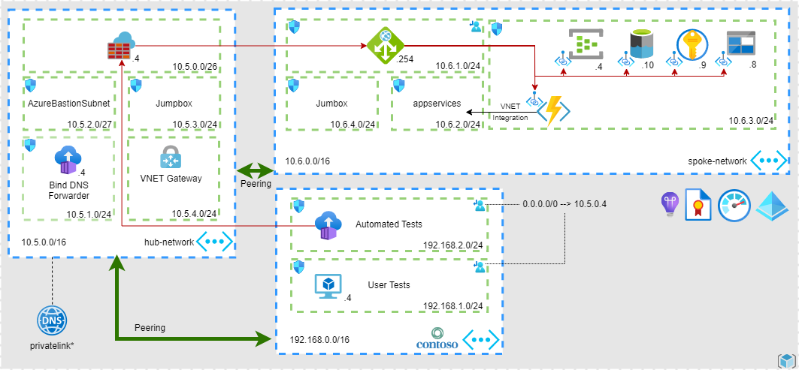

[](https://github.com/Azure/agw-pep-custom-names/actions/workflows/main.yaml)

# Azure Application Gateway: Private Endpoint Custom Name Solution Reference Architecture and Tests

## Goals

* Provide an enviroment to test Application Gateway features and test custom name solution for Azure services.

## Architecture



## Tests

## Azure Application Gateway

> All backend pools are configured with the service FQDN.

### Application Gateway Implicit Tests

If Terraform deployment is successful, then the following features are working:

Service             | Feature
------------------- | -----------
Azure Key Vault     | Reference a certificate in a Private Endpoint Protected Key Vault.
Application Gateway | No Public IP.
Application Gateway | Subnet: No need to define specific inbound rules in NSGs.
Application Gateway | Subnet: route 0.0.0.0 traffic to a Firewall.

### Application Gateway Explicit Tests

> Test developed using .NET 6.0.

Service                                 | Enabled | Protocol | Result | Test Description        | Notes
--------------------------------------- | ------- | -------- | ------ | ------------------------| -----
Cosmos DB SQL API                       | [x]     | https    | Pass   | Create a database       | Uses endpoint & key. Requires the client to **disable endpoint rediscovery**.
Storage Account (Blob)                  | [x]     | https    | Pass   | Create a container      | Uses DefaultAzureCredential (AAD).
Key Vault                               | [x]     | https    | Pass   | Read a secret           | Uses DefaultAzureCredential (AAD).
Azure Functions                         | [x]     | https    | Pass   | Returns a 200 response  | 
Azure Functions KUDU                    | [ ]     | https    |        | TODO                    |
Event Hubs **AmqpWebSockets**           | [x]     | https    | Pass   | Send messages           | Uses DefaultAzureCredential (AAD).
Event Hubs **AmqpTcp**                  | [x]     | tls      | Pass   | Send messages           | Uses DefaultAzureCredential (AAD).
PostegreSQL Single Server User Password | [x]     | tcp      | Pass   | Open connection         | 
PostegreSQL Single Server AAD           | [ ]     | tcp      | Pass   | Open connection         | Uses DefaultAzureCredential (AAD) and **TrustServerCertificate=true** or **SSL Mode=VerifyCA**.
SQL Server User Password                | [x]     | tcp      | Pass   | Open connection         | Uses **TrustServerCertificate=true**.
SQL Server AAD                          | [ ]     | tcp      |**Fail**| Open connection         | If a token is used to authenticate then the `User ID` with the server name cannot be set in the connection string. Attempting to use the token as password also fails. 

The following features are also tested:

Service             | Feature
------------------- | -----------
Application Gateway | Resolves private endpoints using custom DNS.
Application Gateway | TLS / TCP Proxy.

## Running the Tests

## Deploy the Solution

By running the following command, you will deploy the solution to your Azure subscription.

```	powershell
terraform init
terraform apply
```

## Checking Tests Results

Once the solution is deployed, you can download the tests results (**TestResults.trx**) with the following commands:

### PowerShell:

```	powershell
$resultsShareKey=$(terraform output -raw results_share_key)
$resultsShareName=$(terraform output -raw results_share_name)
$resultsAccountName=$(terraform output -raw results_account_name)
$resultsFile=$(terraform output -raw results_file)
$aciStorageContext = New-AzStorageContext -StorageAccountName $resultsAccountName -StorageAccountKey $resultsShareKey
Get-AzStorageFileContent -ShareName $resultsShareName -Path $resultsFile -Context $aciStorageContext -Destination ".\report.trx" -Force
```

### Azure CLI:

```	powershell
$resultsShareKey=$(terraform output -raw results_share_key)
$resultsShareName=$(terraform output -raw results_share_name)
$resultsAccountName=$(terraform output -raw results_account_name)
$resultsFile=$(terraform output -raw results_file)
az storage file download --account-key $resultsShareKey --account-name $resultsAccountName --share-name $resultsShareName --path $resultsFile
```

## Checking Container Logs

### PowerShell:

```	powershell
$resourceGroup=$(terraform output -raw resource_group)
$containerGroup=$(terraform output -raw contaner_group_name)
$containerName=$(terraform output -raw container_name)
Get-AzContainerInstanceLog -ResourceGroupName $resourceGroup -ContainerGroupName $containerGroup -ContainerName $containerName
```

### Azure CLI:

```	powershell
$resourceGroup=$(terraform output -raw resource_group)
$containerGroup=$(terraform output -raw contaner_group_name)
$containerName=$(terraform output -raw container_name)
az container logs --resource-group $resourceGroup --name $containerGroup --container-name $containerName
```

## FAQ

### Where are the services deployed?

Poperty        | Default Value  | Terraform Variable | Required  |
-------------- | -------------- | ------------------ | --------- |
Resource Group | rg-agw-pep     | resource_group     |    [ ]    |
Region         | westeurope     | --------------     |    [ ]    |

### Where are the Terraform modules documented?

Please refer to the [Terraform Modules](TERRAFORM.md) for more information.

## Contributing

This project welcomes contributions and suggestions.  Most contributions require you to agree to a
Contributor License Agreement (CLA) declaring that you have the right to, and actually do, grant us
the rights to use your contribution. For details, visit https://cla.opensource.microsoft.com.

When you submit a pull request, a CLA bot will automatically determine whether you need to provide
a CLA and decorate the PR appropriately (e.g., status check, comment). Simply follow the instructions
provided by the bot. You will only need to do this once across all repos using our CLA.

This project has adopted the [Microsoft Open Source Code of Conduct](https://opensource.microsoft.com/codeofconduct/).
For more information see the [Code of Conduct FAQ](https://opensource.microsoft.com/codeofconduct/faq/) or
contact [opencode@microsoft.com](mailto:opencode@microsoft.com) with any additional questions or comments.

## Trademarks

This project may contain trademarks or logos for projects, products, or services. Authorized use of Microsoft 
trademarks or logos is subject to and must follow 
[Microsoft's Trademark & Brand Guidelines](https://www.microsoft.com/en-us/legal/intellectualproperty/trademarks/usage/general).
Use of Microsoft trademarks or logos in modified versions of this project must not cause confusion or imply Microsoft sponsorship.
Any use of third-party trademarks or logos are subject to those third-party's policies.
